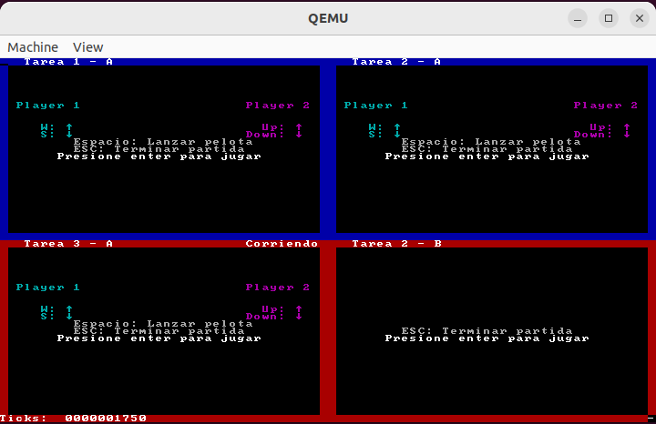

# Orga 2 Kernel
## Descripción: es un kernel Multitarea para arquitectura x86 de 32 bits. Desarrollado en el contexto de la materia Organización del computador 2 (FCEN-UBA) 

 **Resultados:**
  | Visualización de la ejecución de 4 tareas en simultaneo. Cada tarea es un juego que ejecuta de manera independiente.    | 
  | :------------:|
  |   |

### El desarrollo de este kernel abarco la mitad de la materia y consistio en un desarrollo por etapas hasta lograr tener un kernel completo que permita ejecutar varias tareas en simultáneo.
- Modulos   
	- Pasaje de modo real a modo protegido con segmentación flat. Se definió una Global Descriptor Table (GDT) con cuatro segementos utilizando un esquema de segmentación flat, que consistió en cuatro segmentos solapados: dos segmentos de codigo uno de nivel 0 y otro de nivel 3, dos segmentos de datos uno de nivel 0 y otro de nivel 3. Antes de activar paginación es necesario pasar por segmentación debido a la retrocompatibilidad de los procesadores INTEL, este mecanismo está mayormente en desuso.
	- Interrupciones: se generan las estructuras necesarias para el manejo de interrupciones: se define la Interrupt Descriptor Table (IDT) y sus correspondientes handlers de interrupción.  
	- MMU: Se desarrollo una unidad de manejo de memoria utilizando paginación. La unidad de memoria permite crear para una determinada tarea una estructura de paginación independiente con su propio page directroy y sus distintas page tables.   
	- Se utiliza el mecanísmo de cambio de contexto entre tareas provisto por los procesadores INTEL usando Taks Segment Descriptors (TSS). Para esto se desarrollo un modulo para el manejo de tareas, el cual creaba las estructuras necesarias:las entradas en la GDT y sus correspondientes TSS. También se desarrollo un sheduler que intercambia las tareas según una estrategia "round robin", utilizando la interrupción de reloj del procesador para comandar los cambios de contexto en el procesador.  


 -----------------------------
 ! Para compilar y ejecutar se requiere QEMU, NASM, GCC, GDB y python3.
 
* Para compilar y correr gdb 
```
make gdb
```
* Una vez en gdb establecer un breakpoin en kernel.asm y luego continue para ejecutar.
```
(gdb)continue
```
